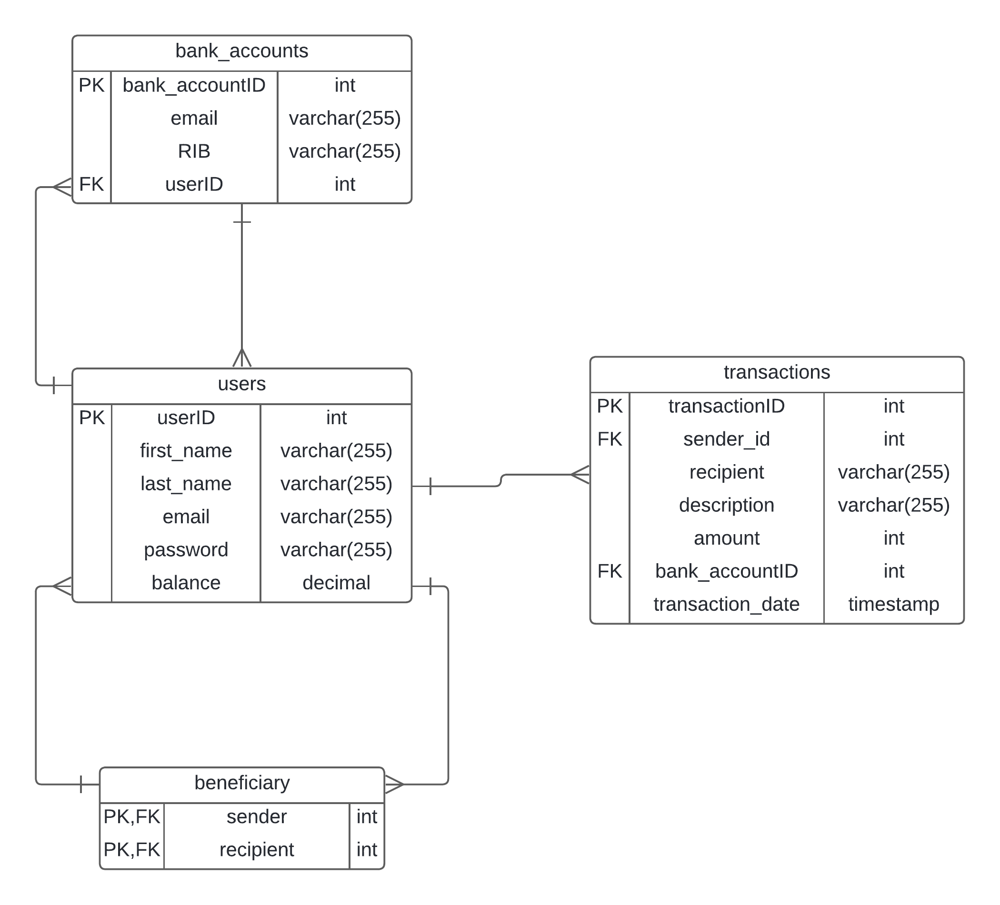

# Pay My Buddy

This is the 6th project of Openclassrooms's Java Developper Training Path.

Summary
-------

The project aims to create a user-friendly application for transferring money, addressing current inefficiencies in the banking system.

### Features:

- User Registration: New users can register with a unique email ID.
- User Login: Users can log in using their credentials stored in the database.
- Adding Friends: Post-login, users can add people to their lists using email addresses (if they exist in the database).
- Deposit Funds: Users can deposit money into their accounts within the application.
- Make Payments: Users can make payments to any other registered user from their available balance.

Set Up:
--------

#### Prerequisites:
- Java 17 or above installed (`java -version` to check)
- Maven or Gradle (build automation tools)

You can either set up the whole project, or you can simply build an executable jar and run the jar.

### 1. Project Setup:

Clean compilation products: `mvn clean`

Compile: `mvn compile`

### 2. Run the Application:

Navigate to your project directory in the terminal and run:

```Bash
mvn spring-boot:run
```

Once started, the application should be available at:

     http://localhost:8080/


### Building the executable jar :

Build the package: `mvn clean package`

Run the jar: `java -jar pay-my-buddy-0.0.1-SNAPSHOT.jar`


## DAL layer
### UML diagram


### Physical data model

